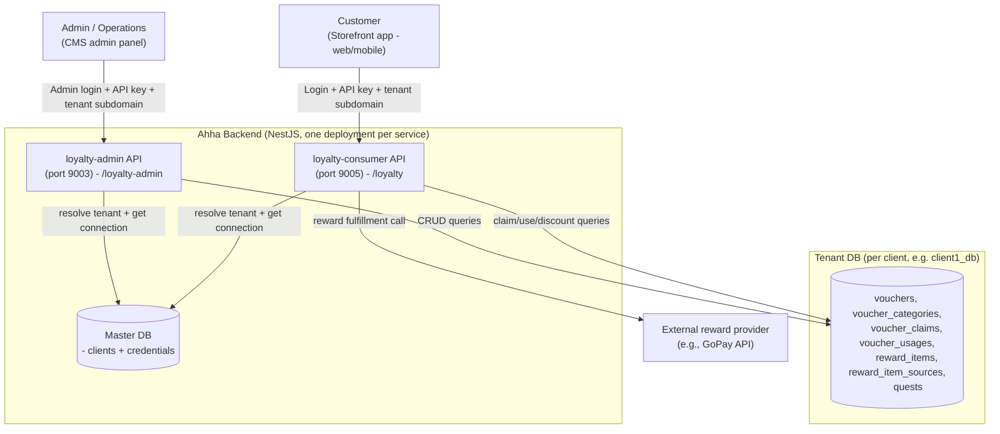
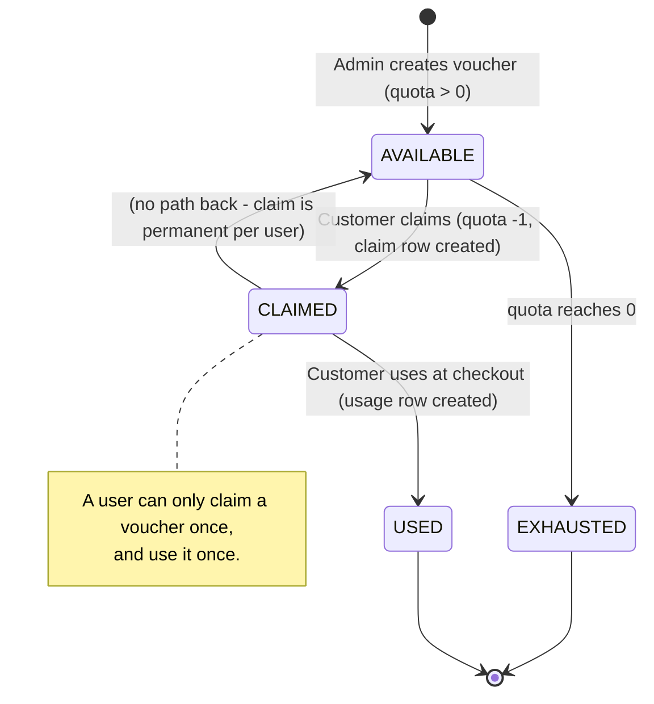
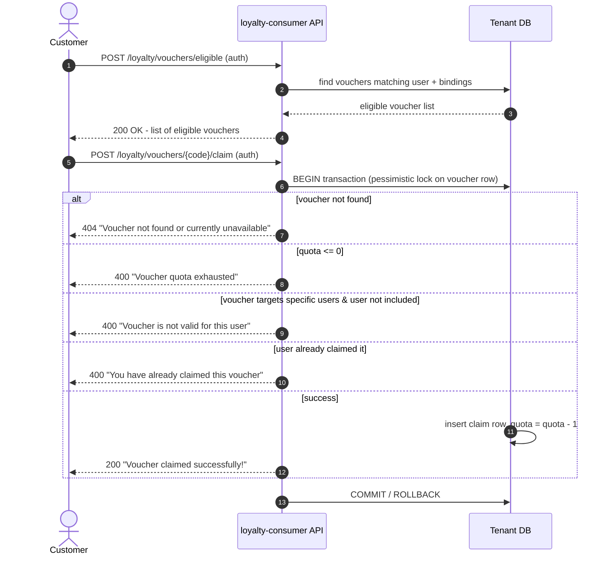
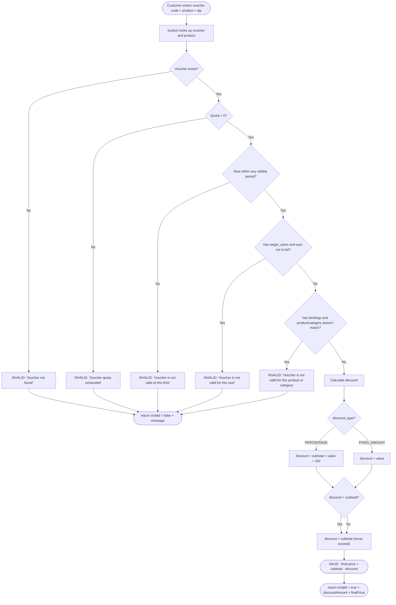
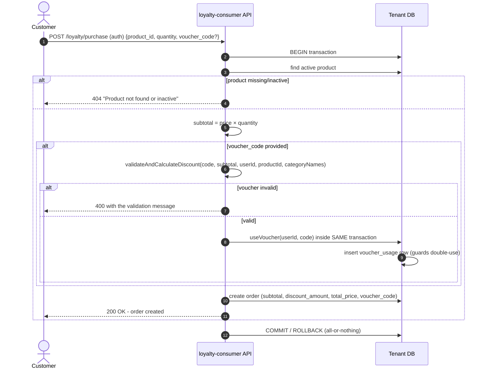
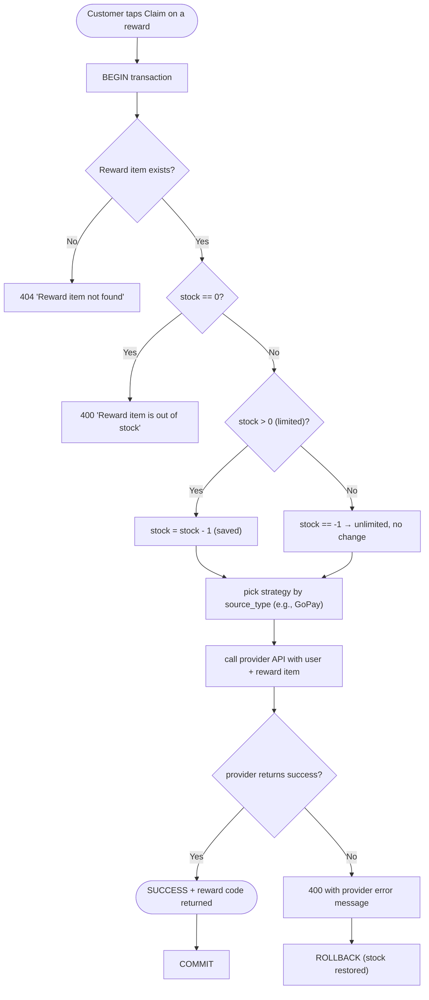
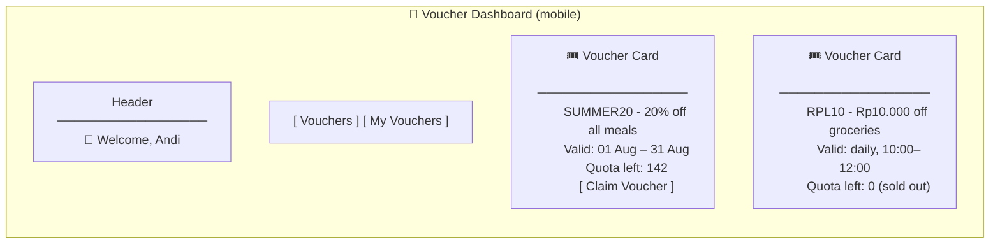
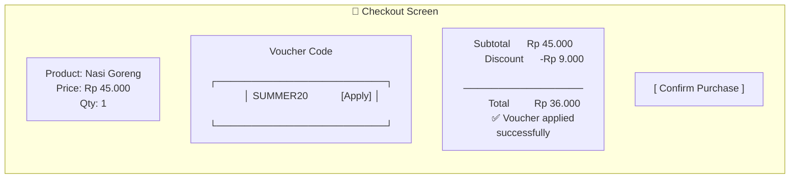
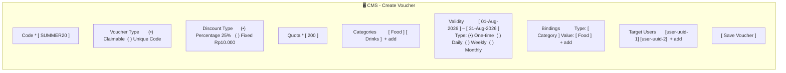

# PRD: Loyalty Feature — Ahha Voucher Engine

> **Read me first (for Junior PO):**
> This document explains **what** the loyalty feature does, **who** uses it, and **how it should behave**.
> It uses plain language, simple tables, and diagrams. If a term is new to you, check the
> **Glossary** at the end. If you want to know _how_ it is built technically, read the
> **Technical Considerations** section — but you do not need it to review the product decisions.

---

## 1. Overview

### 1.1 Problem Statement

Ahha is a multi-tenant e-commerce platform where many clients (tenants) share one system but each
keeps its own database. To keep customers engaged and returning, Ahha wants a **loyalty program**:
a way for customers to earn and use discounts (vouchers), claim rewards, and complete quests.

Today the platform has **partial** loyalty functionality:

- Admins can create vouchers, but the flow that customers use to **claim** and **redeem** vouchers
  at checkout is not fully covered by clear, agreed requirements.
- Customers can see rewards, but there is no clear specification for how reward claiming behaves
  when stock runs out or the external reward provider fails.
- Quests (missions that unlock rewards) are only half-built — admin pages exist but the business
  rules are not implemented.
- There is no shared, reviewable document describing the whole loyalty experience, so Product,
  Engineering, and QA each interpret the feature differently.

> **"Why now?"** Voucher, reward, and quest code already exists in the repository
> (`apps/loyalty-admin`, `apps/loyalty-consumer`, `libs/loyalty`). Without agreed product
> requirements, the team cannot test, prioritize, or extend this feature reliably. This PRD
> turns the existing implementation into a **shared contract** and defines the gaps to close.

### 1.2 Solution Summary

We will deliver a well-defined loyalty program with three pillars:

| Pillar       | What it does                                                                                                                                                                                                                                | Who uses it                         |
| ------------ | ------------------------------------------------------------------------------------------------------------------------------------------------------------------------------------------------------------------------------------------- | ----------------------------------- |
| **Vouchers** | Admins create discount vouchers (percentage or fixed amount) with conditions (valid period, target users, eligible products/categories, quota). Customers browse eligible vouchers, claim them, and use them at checkout to get a discount. | Admin (CMS) + Customer (storefront) |
| **Rewards**  | Admins list reward items (e.g., GoPay credits) with stock. Customers claim a reward; the system calls the reward provider and returns a code.                                                                                               | Admin (CMS) + Customer (storefront) |
| **Quests**   | Admins create quests (missions). _(Currently: admin list works; quest rules are out of scope for v1 — see Scope.)_                                                                                                                          | Admin (CMS)                         |

The whole program runs per tenant: each client's customers only see that client's vouchers and
rewards, and each client's admins only manage their own data.

### 1.3 Target Users

| Persona                      | Description                                               | Main needs                                                                                           |
| ---------------------------- | --------------------------------------------------------- | ---------------------------------------------------------------------------------------------------- |
| **Customer (Consumer)**      | End user shopping on the client's storefront (mobile/web) | Find and claim vouchers, see discount before buying, use voucher at checkout, claim rewards          |
| **Admin / Operations (CMS)** | Client's staff managing their own loyalty catalog         | Create and edit vouchers, categories, reward items and sources, see what customers have claimed/used |
| **Tenant**                   | A client of Ahha (e.g., "client1")                        | Each tenant's data is isolated; branding and catalog are per-tenant                                  |

---

## 2. Goals & Success Metrics

### 2.1 Goals

1. **Primary:** Customers can reliably discover, claim, and use discount vouchers at checkout —
   with the discount always calculated correctly.
2. **Secondary:** Customers can claim rewards from configured providers with clear error handling.
3. **Secondary:** Admins can fully manage vouchers, categories, rewards, and reward sources from the
   CMS, and see usage.
4. **Enabler:** Product, Engineering, and QA agree on behavior through this document (acceptance
   criteria are testable).

### 2.2 Success Metrics

| Metric                                                                   | Current Baseline                                  | Target                                                           | Timeline   |
| ------------------------------------------------------------------------ | ------------------------------------------------- | ---------------------------------------------------------------- | ---------- |
| Voucher discount calculation accuracy (unit + integration tests passing) | Partial tests exist; not all permutations covered | 100% of defined scenarios pass in CI                             | v1 release |
| Voucher claim success rate (API)                                         | Not measured                                      | ≥ 99% (no unexpected 500 errors)                                 | v1 release |
| Voucher redemption (usage) tracked per order                             | Orders record voucher_code                        | 100% of paid orders with voucher have a usage record             | v1 release |
| Reward claim failure handling                                            | External errors surface as generic failure        | 100% of failure modes return a clear message                     | v1 release |
| CMS voucher management coverage                                          | CRUD exists                                       | All CRUD + binding/validity/target-user editing covered by tests | v1 release |

> **Note for PO:** Metrics marked "v1 release" are about _correctness and completeness_, not
> business growth targets (e.g., "increase sales by X%"). Business KPIs (redemption rate, repeat
> purchase) are listed in **Future Considerations** — they need live data first.

### 2.3 Non-Goals

- **Do not** build loyalty points/currency in this iteration (no earning/spending points yet).
- **Do not** build tier progression (Bronze/Silver/Gold) in this iteration.
- **Do not** build customer-facing quests, daily check-in, or gacha in this iteration (admin quest
  list exists; the rest is future).
- **Do not** build analytics dashboards or referral programs in this iteration.
- **Do not** redesign the multi-tenant architecture.

---

## 3. User Stories

| ID    | User Story                                                                                                                                                                   | Priority |
| ----- | ---------------------------------------------------------------------------------------------------------------------------------------------------------------------------- | -------- |
| US-1  | As an **admin**, I want to create a voucher with code, discount type, value, quota, image, and description so that I can launch a discount campaign.                         | P0       |
| US-2  | As an **admin**, I want to attach categories, validity periods, bindings (product/category), and target users to a voucher so that I can control who and what it applies to. | P0       |
| US-3  | As an **admin**, I want to list, view, update, and delete vouchers so that I can manage the catalog.                                                                         | P0       |
| US-4  | As an **admin**, I want to manage voucher categories (CRUD) so that vouchers can be grouped and filtered.                                                                    | P0       |
| US-5  | As a **customer**, I want to see vouchers I am eligible for so that I can find offers I can actually use.                                                                    | P0       |
| US-6  | As a **customer**, I want to claim a voucher so that I own it for later use.                                                                                                 | P0       |
| US-7  | As a **customer**, I want to see the discount before paying (discount preview) so that I can decide whether to use my voucher.                                               | P0       |
| US-8  | As a **customer**, I want to use my voucher at checkout so that I pay a discounted price.                                                                                    | P0       |
| US-9  | As a **customer**, I want to see my claimed vouchers so that I can track what I own.                                                                                         | P1       |
| US-10 | As a **customer**, I want to claim a reward item so that I get the reward code (e.g., GoPay credit).                                                                         | P1       |
| US-11 | As an **admin**, I want to manage reward items and their sources so that customers can claim them.                                                                           | P1       |
| US-12 | As a **customer**, I should never be able to use a voucher twice or claim the same voucher twice so that the system stays fair and accurate.                                 | P0       |

Full acceptance criteria per story are embedded in **Section 5 (Functional Requirements)** — each
requirement is written so a tester can verify it.

---

## 4. Solution Design

### 4.1 System Architecture (Simplified)

**How to read this diagram:** every request first identifies the **tenant** (via subdomain) and
validates the **API key**. Then the backend connects to that tenant's own database. This is why
"client1" never sees "client2" vouchers.

### 4.2 Voucher Lifecycle

### 4.3 Core Flow: Customer Claims a Voucher

### 4.4 Core Flow: Discount Calculation at Checkout

> **PO note:** This diagram is the "rulebook" for discounts. The discount can **never** be negative
> and can **never** make the price negative — at most the item is free (discount capped at subtotal).

### 4.5 Core Flow: Checkout (Purchase) with Voucher

> **Why this matters (PO note):** voucher usage and order creation happen in **one transaction**.
> If the order fails for any reason, the voucher is **not** consumed. The customer never loses a
> voucher because of a failed payment/order.

### 4.6 Core Flow: Reward Claiming

> **PO note:** if the external provider fails, the transaction rolls back — the reward stock is
> **not** consumed. This is important for financial accuracy.

### 4.7 UI Mockups (Wireframes)

> These are **loose wireframes** to align on layout and content — not final visual design.

#### Mockup A — Customer: Voucher Dashboard (Storefront)

#### Mockup B — Customer: Checkout with Discount Preview (Storefront)

#### Mockup C — Admin: Create/Edit Voucher (CMS)

---

## 5. Functional Requirements

> Requirements are grouped by area. Each one is **testable**: QA can write a check for every line.
> Priority: **P0** = must work for v1; **P1** = important, include if capacity allows; **P2** = later.

### 5.1 Admin: Voucher Management (P0)

| ID   | Requirement                                                                                                                                                                                                                                                                                                              | Priority |
| ---- | ------------------------------------------------------------------------------------------------------------------------------------------------------------------------------------------------------------------------------------------------------------------------------------------------------------------------ | -------- |
| FR-1 | Admin can create a voucher with: `code` (required, unique), `voucher_type` (CLAIMABLE/UNIQUE_CODE, default CLAIMABLE), `description`, `quota` (required, int), `image`, `discount_type` (PERCENTAGE/FIXED_AMOUNT), `discount_value`, `categories`, `allow_combine_categories`, `validities`, `bindings`, `target_users`. | P0       |
| FR-2 | Creating a voucher with a duplicate `code` must be rejected.                                                                                                                                                                                                                                                             | P0       |
| FR-3 | Admin can list vouchers with pagination, search, sort.                                                                                                                                                                                                                                                                   | P0       |
| FR-4 | Admin can view a single voucher by id/code.                                                                                                                                                                                                                                                                              | P0       |
| FR-5 | Admin can update a voucher (all editable fields).                                                                                                                                                                                                                                                                        | P0       |
| FR-6 | Admin can delete a voucher (soft delete — it disappears from listings but history is kept).                                                                                                                                                                                                                              | P0       |
| FR-7 | All admin voucher endpoints require admin JWT + ACL permission `read:vouchers` / `write:vouchers`.                                                                                                                                                                                                                       | P0       |
| FR-8 | **Validity**: a voucher can have multiple validity entries; types are `daily`, `birthday`, `weekly`, `custom_day_weekly`, `monthly`, `one_time`, each with `start_date`/`end_date` (+ `start_time`/`end_time`, `valid_days` where applicable).                                                                           | P1       |
| FR-9 | **Bindings**: a voucher can be bound to `role`, `product_type`, `product_sku`, `product_vendor`, `user_group`, `product`, `category`; at validation time, **product** and **category** bindings are enforced by the system.                                                                                              | P1       |

### 5.2 Admin: Voucher Category Management (P0)

| ID    | Requirement                                                                                                   | Priority |
| ----- | ------------------------------------------------------------------------------------------------------------- | -------- |
| FR-10 | Admin can create a voucher category (`slug` unique PK, `name`, `description`, `image`).                       | P0       |
| FR-11 | Admin can list categories (paginated), view one by slug, update, and delete.                                  | P0       |
| FR-12 | Category endpoints require admin JWT + ACL permission `read:voucher-categories` / `write:voucher-categories`. | P0       |

### 5.3 Consumer: Voucher Browsing & Eligibility (P0)

| ID    | Requirement                                                                                                                                                       | Priority |
| ----- | ----------------------------------------------------------------------------------------------------------------------------------------------------------------- | -------- |
| FR-13 | Customer (authenticated) can get the list of **eligible** vouchers via `POST /loyalty/vouchers/eligible`; `user_id` is taken from the token, never from the body. | P0       |
| FR-14 | Eligibility filter by `bindings` (list of `{bind_type, bind_value}`) is supported; when no bindings filter is sent, all vouchers are returned.                    | P1       |
| FR-15 | Customer can get their **claimed** vouchers via `GET /loyalty/vouchers/my` (paginated), including validity info.                                                  | P1       |
| FR-16 | Both endpoints require a valid consumer JWT.                                                                                                                      | P0       |

### 5.4 Consumer: Voucher Claiming (P0)

| ID    | Requirement                                                                                                          | Priority |
| ----- | -------------------------------------------------------------------------------------------------------------------- | -------- |
| FR-17 | Customer can claim a voucher via `POST /loyalty/vouchers/{code}/claim`.                                              | P0       |
| FR-18 | Claiming must be atomic (transaction) and lock the voucher row so two simultaneous claims cannot over-consume quota. | P0       |
| FR-19 | If voucher is not found → 404 "Voucher not found or currently unavailable".                                          | P0       |
| FR-20 | If quota ≤ 0 → 400 "Voucher quota exhausted".                                                                        | P0       |
| FR-21 | If voucher has target users and the customer is not one of them → 400 "Voucher is not valid for this user".          | P0       |
| FR-22 | If the customer already claimed this voucher → 400 "You have already claimed this voucher" (no duplicate claims).    | P0       |
| FR-23 | On success: a `voucher_claims` row is created and voucher `quota` is decremented by exactly 1.                       | P0       |

### 5.5 Consumer: Discount Calculation (P0)

| ID    | Requirement                                                                                                                                                      | Priority |
| ----- | ---------------------------------------------------------------------------------------------------------------------------------------------------------------- | -------- |
| FR-24 | Customer can preview discount via `POST /loyalty/vouchers/calculate-discount` with `{voucher_code, product_id, quantity}` (authenticated).                       | P0       |
| FR-25 | Validation order: existence → quota → validity period → target users → bindings. First failing check wins, and the response includes a human-readable `message`. | P0       |
| FR-26 | `subtotal = product.price × quantity`; product must be active, else 404 "Product not found".                                                                     | P0       |
| FR-27 | PERCENTAGE: `discount = subtotal × discount_value ÷ 100`. FIXED_AMOUNT: `discount = discount_value`.                                                             | P0       |
| FR-28 | Discount is capped at subtotal (never exceeds; final price never negative).                                                                                      | P0       |
| FR-29 | Response: `{ isValid, discountAmount, finalPrice, message }` (consumer-side DTO naming).                                                                         | P0       |

### 5.6 Consumer: Purchase / Checkout with Voucher (P0)

| ID    | Requirement                                                                                                                                                                                                                    | Priority |
| ----- | ------------------------------------------------------------------------------------------------------------------------------------------------------------------------------------------------------------------------------ | -------- |
| FR-30 | Customer can place an order via `POST /loyalty/purchase` with `{product_id, quantity, voucher_code?}` (authenticated).                                                                                                         | P0       |
| FR-31 | Product must exist and be active → else 404.                                                                                                                                                                                   | P0       |
| FR-32 | If `voucher_code` is provided: calculate discount; if invalid → 400 with the validation message (order NOT created).                                                                                                           | P0       |
| FR-33 | If voucher is valid: `useVoucher` records usage in the **same transaction**; if the customer has not claimed the voucher → 400 "You have not claimed this voucher yet"; if already used → 400 "Voucher has already been used". | P0       |
| FR-34 | Order records: `subtotal`, `discount_amount`, `total_price`, `voucher_code` (null when no voucher).                                                                                                                            | P0       |
| FR-35 | All-or-nothing: order creation and voucher usage commit/rollback together.                                                                                                                                                     | P0       |

### 5.7 Admin: Reward Items & Sources (P1)

| ID    | Requirement                                                                                                                     | Priority |
| ----- | ------------------------------------------------------------------------------------------------------------------------------- | -------- |
| FR-36 | Admin can CRUD reward items: `name`, `type` (e.g., gopay, pulsa), `stock` (-1 unlimited, 0 out of stock, >0 limited), `source`. | P1       |
| FR-37 | Admin can CRUD reward item sources: `name`, `source_type`, `api_endpoint`, `apiKey` (stored securely).                          | P1       |
| FR-38 | Both support pagination/search/sort.                                                                                            | P1       |

### 5.8 Consumer: Reward Claiming (P1)

| ID    | Requirement                                                                                                                                                    | Priority |
| ----- | -------------------------------------------------------------------------------------------------------------------------------------------------------------- | -------- |
| FR-39 | Customer can list all reward items (`GET /rewards`, authenticated).                                                                                            | P1       |
| FR-40 | Customer can claim a reward (`POST /rewards/claim/{reward_id}`, authenticated).                                                                                | P1       |
| FR-41 | Reward item not found → 404. Stock = 0 → 400 "Reward item is out of stock".                                                                                    | P1       |
| FR-42 | Claim is transactional: limited stock is decremented; if provider call fails → 400 with provider message and stock is restored (rollback).                     | P1       |
| FR-43 | Claim resolves strategy by `source.source_type` (strategy pattern — GoPay implemented; other providers pluggable). Success returns the provider's reward code. | P1       |

### 5.9 Quests (P2 — partially built)

| ID    | Requirement                                                                                                                | Priority |
| ----- | -------------------------------------------------------------------------------------------------------------------------- | -------- |
| FR-44 | Admin can list quests (currently the only implemented quest operation).                                                    | P2       |
| FR-45 | _(Future)_ Admin create/update/delete quest business logic; customer quest progress/completion. See Future Considerations. | P2       |

### 5.10 Edge Cases

| Scenario                                                                  | Expected Behavior                                                                   |
| ------------------------------------------------------------------------- | ----------------------------------------------------------------------------------- |
| Two customers claim the last voucher at the same time                     | Pessimistic lock: one succeeds; the other gets "quota exhausted" (no oversell)      |
| Customer claims the same voucher twice                                    | Second attempt rejected: "You have already claimed this voucher"                    |
| Voucher used in two orders at the same time                               | `useVoucher` inside transaction rejects the second: "Voucher has already been used" |
| Discount value larger than subtotal (e.g., 50% off Rp 1.000)              | Discount capped at subtotal; final price = 0 (free, never negative)                 |
| Voucher has validity entries but now is outside all of them               | "Voucher is not valid at this time"                                                 |
| Voucher has bindings but product/category doesn't match                   | "Voucher is not valid for this product or category"                                 |
| Voucher targets specific users; customer not targeted                     | "Voucher is not valid for this user"                                                |
| Reward stock = 0                                                          | "Reward item is out of stock" (no provider call)                                    |
| Reward provider returns non-200 / timeout                                 | Transaction rolls back, stock restored, clear error returned to customer            |
| Reward stock = -1 (unlimited)                                             | Claim succeeds; stock unchanged                                                     |
| Order fails after voucher validated (e.g., product inactive mid-checkout) | Whole transaction rolls back; voucher NOT consumed                                  |
| `user_id` passed in eligible-vouchers body                                | Ignored — server always uses token user (security)                                  |

---

## 6. Technical Considerations

> This section is for Engineering. It surfaces constraints — it is **not** a full technical design.

### 6.1 Constraints

- **Multi-tenant isolation:** every tenant has its own database. Services must always use the
  `DataSource` obtained per-request from `DatabaseService` — never a global/shared repository for
  tenant entities. Requests are routed via subdomain middleware → credential (API key) middleware;
  `OPTIONS` (CORS preflight) requests bypass tenant checks.
- **Monetary correctness:** all money uses `decimal(12,2)`, never float. Discount math must use
  precise arithmetic and cap at subtotal.
- **Atomicity:** `claimVoucher`, `useVoucher` (+order creation), and `claimReward` must run inside
  TypeORM transactions. Voucher row must be locked (`pessimistic_write`) during claim to prevent
  quota oversell.
- **Snake case:** DB columns via `SnakeNamingStrategy`.
- **Auth:** admin endpoints → `AdminJwtGuard` (+ `AclGuard` with permissions); consumer endpoints →
  `ConsumerJwtGuard`. `user_id` always derived from JWT.
- **Security:** reward source `apiKey` is sensitive — must not be logged or returned in API
  responses.

### 6.2 Integration Points

| System                                       | Integration notes                                                                                                              |
| -------------------------------------------- | ------------------------------------------------------------------------------------------------------------------------------ |
| Product domain (`libs/product`)              | Discount validation reads `ProductEntity` + categories; purchase flow creates `OrderEntity` via `OrderService`                 |
| Auth (`libs/auth`)                           | `ConsumerJwtGuard`, `AdminJwtGuard`, `AclGuard`, `Permissions` decorator                                                       |
| Database (`libs/database`)                   | `DatabaseService.getConnection(databaseName, entityPath...)` for per-tenant DataSource                                         |
| External reward providers                    | Strategy pattern: `RewardClaimStrategy` interface + factory by `source_type`; GoPay implemented (axios POST with bearer token) |
| Frontend consumer (`apps/frontend-consumer`) | Voucher dashboard, detail, checkout, my-vouchers pages                                                                         |
| Frontend CMS (`apps/frontend-cms`)           | Voucher + category + reward management pages                                                                                   |

### 6.3 Data Requirements

- No migration needed for v1 beyond what exists (entities already in `libs/loyalty`). Soft deletes
  via `BaseEntity.deleted_at`.
- Claim history (`voucher_claims`) and usage history (`voucher_usages`) are append-only records —
  never hard-delete.
- Sensitive columns: reward source `apiKey`; client DB credentials encrypted (existing
  `EncryptionService`).

---

## 7. Dependencies & Risks

### 7.1 Dependencies

| Dependency                                                     | Owner          | Status                    | Impact if Delayed                          |
| -------------------------------------------------------------- | -------------- | ------------------------- | ------------------------------------------ |
| Backend loyalty services (`loyalty-admin`, `loyalty-consumer`) | Engineering    | Implemented (core flows)  | —                                          |
| Product catalog + order service                                | Engineering    | Implemented               | Blocks discount/purchase flows             |
| Auth/ACL (JWT guards, permissions)                             | Engineering    | Implemented               | Blocks all endpoints                       |
| Multi-tenant DB service + middleware                           | Engineering    | Implemented               | Blocks everything                          |
| External reward provider (GoPay etc.)                          | Partner/Vendor | External                  | Reward claiming cannot be fully E2E tested |
| Frontend CMS + consumer apps                                   | Engineering    | Implemented (pages exist) | UX cannot be demoed                        |

### 7.2 Risks

| Risk                                                   | Likelihood | Impact | Mitigation                                                                                  |
| ------------------------------------------------------ | ---------- | ------ | ------------------------------------------------------------------------------------------- |
| Quota oversell under concurrency                       | M          | H      | Pessimistic lock during claim; integration tests for simultaneous claims                    |
| Double usage of voucher across orders                  | M          | H      | Usage recorded inside the order transaction; unique check per (voucher, user); tests        |
| Floating point drift in discount math                  | M          | H      | `decimal(12,2)`; cap discount at subtotal; test boundary values (e.g., discount > subtotal) |
| Provider downtime breaks reward claim UX               | M          | M      | Clear error + rollback so stock isn't consumed; retry guidance in copy                      |
| Tenant isolation broken (cross-tenant data leak)       | L          | H      | Enforce per-request DataSource; E2E test client1 vs client2 isolation                       |
| Quest business logic unimplemented (half-built module) | H          | M      | Explicitly scoped out of v1; no claims of quest functionality in release notes              |

---

## 8. Timeline & Milestones

| Milestone                | Description                                                                                                          | Target |
| ------------------------ | -------------------------------------------------------------------------------------------------------------------- | ------ |
| M1 — Requirements freeze | PRD reviewed and approved by Product + Engineering + QA                                                              | Week 1 |
| M2 — Test contract       | Unit/integration test suite covering all P0 FRs (discount permutations, claim/use concurrency, edge cases)           | Week 2 |
| M3 — Gap closure         | Fix any behavior that does not match FRs; finalize reward error handling                                             | Week 3 |
| M4 — E2E + QA pass       | End-to-end flows: admin creates voucher → customer claims → checkout discount → reward claim; tenant isolation check | Week 4 |
| M5 — Release (v1)        | P0 complete, metrics green in CI                                                                                     | Week 5 |

> Dates are indicative; exact dates depend on team capacity. P1 items (rewards UX polish, category
> coverage) land by v1.1 unless capacity allows earlier.

---

## 9. Open Questions

- [ ] Should voucher `quota` be decremented at **claim** (current behavior) or at **use**? Affects
      campaign math. — Owner: Product
- [ ] Is `UNIQUE_CODE` voucher type (per-customer unique codes) in scope for v1 or v1.1? Currently
      only `CLAIMABLE` flows are exercised end-to-end. — Owner: Product
- [ ] Should reward claiming require spending points or any balance? (Currently free-form claim.)
      — Owner: Product
- [ ] Who owns the external reward provider contract/credentials for staging tests? — Owner: DevOps
- [ ] Should admin voucher delete be soft delete with restore, or hard delete? (Currently soft via
      `BaseEntity`.) — Owner: Product

---

## 10. Appendix

### 10.1 Glossary (for Junior PO)

| Term                 | Plain-English meaning                                                                                                                            |
| -------------------- | ------------------------------------------------------------------------------------------------------------------------------------------------ |
| **Tenant**           | One client of Ahha (e.g., "client1"). Each tenant has its own database and catalog.                                                              |
| **Voucher**          | A discount coupon. Has a code, a discount (percentage or fixed amount), a quota, and conditions.                                                 |
| **Quota**            | The total number of times a voucher can be claimed. When it hits 0, the voucher is sold out.                                                     |
| **Claim**            | A customer "takes" a voucher into their account. Claiming decreases quota by 1.                                                                  |
| **Use / Redeem**     | The customer applies the voucher at checkout. Each claim can be used once.                                                                       |
| **Validity**         | The time period(s) when a voucher can be used (e.g., daily 10:00–12:00, or 1 Aug–31 Aug).                                                        |
| **Binding**          | A condition tying the voucher to specific products or categories (e.g., "only for Food").                                                        |
| **Target users**     | If set, only these specific users can claim the voucher. If empty, everyone can.                                                                 |
| **Discount type**    | How the discount is calculated: `PERCENTAGE` (e.g., 20% off) or `FIXED_AMOUNT` (e.g., Rp10.000 off).                                             |
| **Reward item**      | Something a customer can claim, e.g., GoPay credit. Has stock (-1 = unlimited, 0 = out, >0 = limited).                                           |
| **Reward source**    | The external provider that fulfills a reward (e.g., GoPay API), with endpoint + API key.                                                         |
| **Strategy pattern** | A code pattern where each reward provider implements the same "claim" interface, so new providers can be added without rewriting the core logic. |
| **Pessimistic lock** | A database lock that prevents two people claiming the last voucher at the same time.                                                             |
| **Transaction**      | A group of database operations that all succeed or all fail together (atomic).                                                                   |
| **Soft delete**      | Marking a row deleted (via `deleted_at`) instead of removing it, so history is preserved.                                                        |
| **ACL**              | Access Control List — permissions like `write:vouchers` that decide which admins can do what.                                                    |
| **JWT**              | The login token that identifies a customer/admin. The user ID for loyalty actions always comes from this token.                                  |

### 10.2 Related Documents

- Repo agent guide: `AGENTS.md` (architecture, entities, services)
- Existing feature inventory & gap analysis: `loyalty_features_analysis.md` (repo root)
- Voucher API test cases: `docs/voucher-api-test-cases.md`
- Auth/ACL: `libs/auth/src` (guards, ACL service, permissions decorator)

### 10.3 Future Considerations (explicitly NOT in v1)

| Future item                                                             | Why deferred                                                   |
| ----------------------------------------------------------------------- | -------------------------------------------------------------- |
| Loyalty points/currency (earn + spend)                                  | New subsystem; needs its own PRD                               |
| Tier management & progression (Bronze/Silver/Gold)                      | Depends on points or spending history                          |
| Customer-facing quests (view/accept/track/claim), daily check-in, gacha | Gamification sprint; quest admin logic must be completed first |
| Notifications (new vouchers, rewards, tier changes)                     | Needs notification infrastructure                              |
| Analytics & reporting dashboards                                        | Needs live data and BI tooling                                 |
| Campaign management (double points, limited-time offers)                | Needs points + campaigns subsystem                             |
| Referral program                                                        | Standalone marketing feature                                   |
| Business KPIs (redemption rate, repeat purchase rate)                   | Requires production data after v1                              |

### 10.4 Revision History

| Version | Date       | Author                  | Changes                                                  |
| ------- | ---------- | ----------------------- | -------------------------------------------------------- |
| 1.0     | 2026-08-12 | AI (Product Owner role) | Initial draft from codebase analysis + deliver-prd skill |
