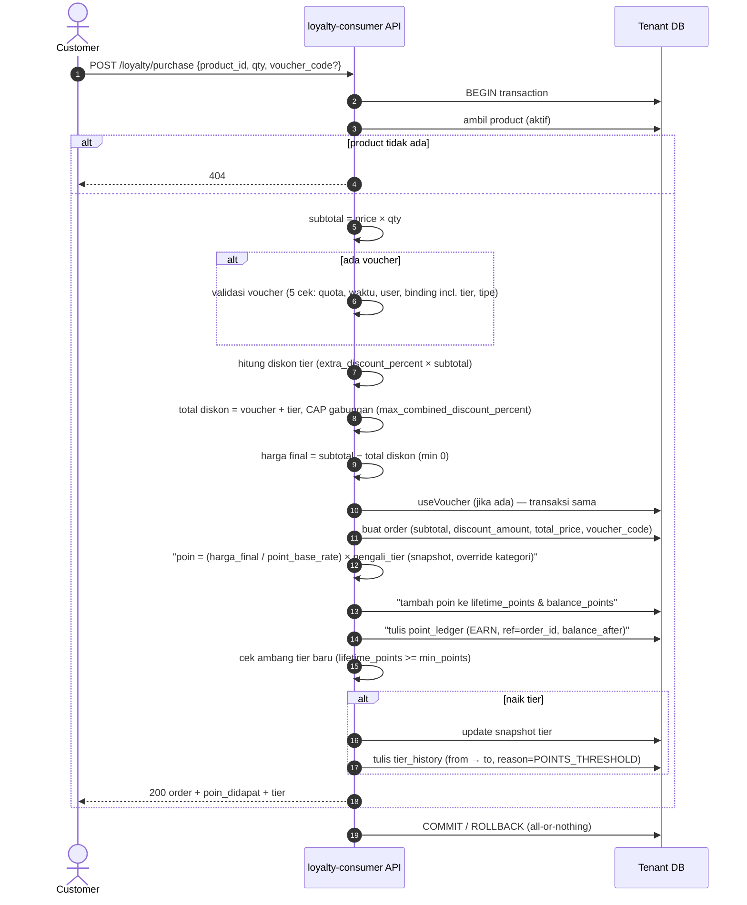
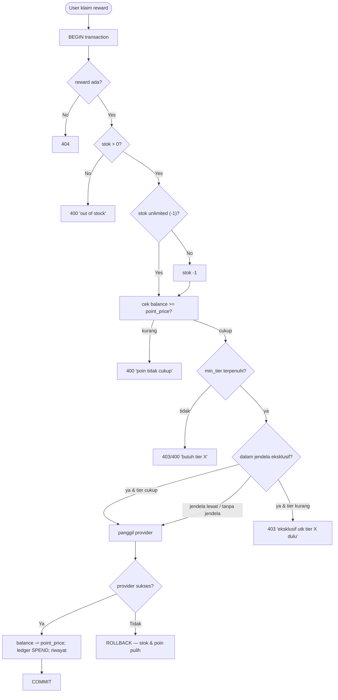

# Loyalty Tier System — Design Spec

## 1. Overview

### 1.1 Problem Statement

Ahha's loyalty program currently has vouchers, rewards, and (half-built) quests, but **no tier
system and no points currency**. Customers cannot be rewarded proportionally to their spend, cannot
"level up," and vouchers cannot be targeted at high-value segments. This limits the program's value
for retention and upselling.

### 1.2 Solution Summary

Add a **loyalty tier system** built on a **points currency**:

1. Every purchase earns **points** computed from the final price (after all discounts) × a
   configurable per-tenant **base rate** × the user's **tier multiplier** (which can be overridden
   per product category).
2. Points accumulate into **lifetime points** (a progress score that never decreases) and
   **balance points** (a spendable balance).
3. Users **level up automatically and in real time** when lifetime points cross an admin-defined
   threshold; the new tier applies from the _next_ transaction.
4. Tiers provide benefits: point multiplier, extra discount (stackable with vouchers, combined
   capped), badge/label, exclusive access (voucher targeting via a new `tier` binding), and
   priority rewards (exclusive claim windows).
5. **All reward items become point-priced**; claiming a reward costs balance points.
6. A **full point ledger** (earn/spend/rollback/manual adjustment), **tier history**, consumer
   point history UI, and admin manual point adjustment round out the system.

### 1.3 Target Users

| Persona     | Needs                                                                                                                                                    |
| ----------- | -------------------------------------------------------------------------------------------------------------------------------------------------------- |
| Customer    | Earn points on purchases, see tier + badge, progress to next tier, spend points on rewards, see point history                                            |
| Admin (CMS) | Configure tiers (thresholds, multipliers, discounts, category overrides), price rewards in points, target vouchers at tiers, adjust user points manually |
| Tenant      | Per-tenant config (base rate, combined discount cap) with full data isolation                                                                            |

## 2. Goals & Success Metrics

### Goals

1. Customers can earn points and visibly progress through tiers (retention driver).
2. Vouchers can be targeted at tiers (segmentation capability for campaigns).
3. Rewards are point-priced with correct balance accounting and rollback safety.
4. Every point movement is auditable (ledger) and user-visible.

### Success Metrics

| Metric                                                                                           | Baseline  | Target                                               | Timeline |
| ------------------------------------------------------------------------------------------------ | --------- | ---------------------------------------------------- | -------- |
| Purchase flow credit: 100% of completed orders earn correct points                               | n/a (new) | All integration tests green                          | v1       |
| Ledger integrity: every EARN/SPEND/ROLLBACK/ADJUSTMENT has balance_after consistent with balance | n/a       | All unit tests green                                 | v1       |
| Level-up: tier snapshot updates exactly when threshold crossed                                   | n/a       | Tests cover boundary (exact threshold, below, above) | v1       |
| Combined discount cap never exceeded                                                             | n/a       | Tests cover cap boundary                             | v1       |
| Reward claim rollback: provider failure restores stock + points                                  | n/a       | Test green                                           | v1       |
| No negative balance possible                                                                     | n/a       | Tests cover manual adjustment + spend edge cases     | v1       |

### Non-Goals

- Point expiry (deferred; ledger design supports it later)
- Points earned from quests/daily-check-in/gacha (deferred — separate future work)
- Tier demotion (lifetime points never decrease)
- Tiers based on rolling spend or admin-only assignment
- Analytics dashboards / referrals / campaigns (separate future work)

## 3. Design Decisions (agreed)

| #   | Decision                                                                                                                                                                                                                                                                   |
| --- | -------------------------------------------------------------------------------------------------------------------------------------------------------------------------------------------------------------------------------------------------------------------------- |
| 1   | Tier basis: **lifetime points** with admin-configured `min_points` thresholds                                                                                                                                                                                              |
| 2   | Points formula: `points = (final_price / point_base_rate) × tier_multiplier` (default semantics: `point_base_rate` = rupiah per point, so a rate of 1000 = 1 point per Rp 1.000); final price = subtotal after ALL discounts (voucher + tier); decimal points, no rounding |
| 3   | Tier structure: **flexible** count (admin CRUD); thresholds, multipliers, discounts configured per tier                                                                                                                                                                    |
| 4   | Multiplier: default per tier, **overridable per product category**                                                                                                                                                                                                         |
| 5   | Level-up: **automatic + real-time** inside the purchase transaction; new tier applies from the **next** transaction (snapshot read at transaction start)                                                                                                                   |
| 6   | Voucher tier targeting: new `bind_type = 'tier'` (bind_value = tier id); reuses existing binding structure; admin UI shows a tier dropdown                                                                                                                                 |
| 7   | Points are **spendable**: lifetime points (progress, never decreases) + balance points (spendable, decreases)                                                                                                                                                              |
| 8   | **All rewards become point-priced**; claim = check balance → deduct → provider call → ledger                                                                                                                                                                               |
| 9   | Tier benefits: point multiplier, extra discount %, badge/label, exclusive access (binding `tier`), priority rewards (exclusive claim window)                                                                                                                               |
| 10  | Extra discount: fixed `extra_discount_percent` per tier, **stackable with vouchers**, combined discount capped at `max_combined_discount_percent` (default 50)                                                                                                             |
| 11  | **Full ledger**: every point event with reference; tier history; consumer point history UI; admin manual adjustment                                                                                                                                                        |
| 12  | Point expiry: **deferred**; ledger supports batch + occurred_at for later FIFO expiry                                                                                                                                                                                      |
| 13  | Points earned **only from purchases** for now (quests/gamification later)                                                                                                                                                                                                  |
| 14  | Spending points does **not** reduce lifetime points                                                                                                                                                                                                                        |

## 4. Solution Design

### 4.1 Architecture

Follows existing patterns: NestJS apps (`loyalty-admin`, `loyalty-consumer`), `libs/loyalty` domain,
per-tenant `DataSource` from `DatabaseService`, snake_case via `SnakeNamingStrategy`, `BaseEntity`
soft deletes, `decimal(12,2)` for money/points where precision matters.

### 4.2 Data Model

#### New entities

```typescript
// loyalty_tiers
@Entity('loyalty_tiers')
class LoyaltyTierEntity extends BaseEntity {
  @PrimaryGeneratedColumn('uuid') id: string;
  @Column() name: string;
  @Column('int') level: number; // ordering 1,2,3...
  @Column('decimal') min_points: number; // threshold to reach this tier
  @Column('decimal') point_multiplier: number;
  @Column('decimal', { default: 0 }) extra_discount_percent: number;
  @Column('boolean', { default: true }) is_active: boolean;
  @Column('int', { default: 0 }) exclusive_window_hours: number; // 0 = none
}

// loyalty_tier_category_overrides
@Entity('loyalty_tier_category_overrides')
class TierCategoryOverrideEntity extends BaseEntity {
  @PrimaryGeneratedColumn('uuid') id: string;
  @ManyToOne(() => LoyaltyTierEntity) tier: LoyaltyTierEntity;
  @ManyToOne(() => VoucherCategoryEntity) category: VoucherCategoryEntity;
  @Column('decimal') point_multiplier: number;
}

// point_ledger
@Entity('point_ledger')
class PointLedgerEntity extends BaseEntity {
  @PrimaryGeneratedColumn('uuid') id: string;
  @ManyToOne(() => LoyaltyUserEntity) user: LoyaltyUserEntity;
  @Column() event_type: string; // 'EARN' | 'SPEND' | 'ROLLBACK' | 'ADJUSTMENT'
  @Column('decimal') amount: number; // + in / - out
  @Column('decimal') balance_after: number; // balance after event
  @Column({ nullable: true }) reference_type: string; // 'ORDER' | 'REWARD_CLAIM' | ...
  @Column({ nullable: true }) reference_id: string;
  @Column({ type: 'timestamptz' }) occurred_at: Date; // supports future batch expiry
}

// tier_history
@Entity('tier_history')
class TierHistoryEntity extends BaseEntity {
  @PrimaryGeneratedColumn('uuid') id: string;
  @ManyToOne(() => LoyaltyUserEntity) user: LoyaltyUserEntity;
  @ManyToOne(() => LoyaltyTierEntity) from_tier: LoyaltyTierEntity;
  @ManyToOne(() => LoyaltyTierEntity) to_tier: LoyaltyTierEntity;
  @Column() reason: string; // 'POINTS_THRESHOLD' | 'MANUAL'
  @Column({ type: 'timestamptz' }) changed_at: Date;
}
```

#### Modified entities

```typescript
// loyalty_users — add snapshot + balances
@Entity('loyalty_users')
class LoyaltyUserEntity {
  @PrimaryGeneratedColumn('uuid') id: string;
  @Column({ type: 'uuid', unique: true }) core_user_id: string;
  @ManyToOne(() => LoyaltyTierEntity) tier: LoyaltyTierEntity | null; // NEW
  @Column('decimal', { default: 0 }) lifetime_points: number; // NEW
  @Column('decimal', { default: 0 }) balance_points: number; // NEW
}

// reward_items — add point price + tier gating
@Entity('reward_items')
class RewardItemEntity {
  @PrimaryGeneratedColumn('uuid') id: string;
  @Column() name: string;
  @Column() type: string;
  @Column({ default: -1 }) stock: number;
  @ManyToOne(() => RewardItemSourceEntity) source: RewardItemSourceEntity;
  @Column('decimal', { default: 0 }) point_price: number; // NEW
  @ManyToOne(() => LoyaltyTierEntity) min_tier: LoyaltyTierEntity | null; // NEW
  @Column('int', { default: 0 }) exclusive_days: number; // NEW
}
```

#### Tenant configuration (per-tenant)

- `point_base_rate`: currency per point (e.g., 1 point per Rp 1.000) — flexible, admin-configurable
- `max_combined_discount_percent`: default 50

### 4.3 Core Flow: Purchase + Points + Level-Up

`POST /loyalty/purchase` (extended; all in one DB transaction with the order):



Key rules:

- Tier snapshot read at transaction start → the transaction that causes a level-up still uses the
  old multiplier (level-up applies from next transaction).
- Points from **final price** (after all discounts) × base_rate × multiplier.
- Points stored decimal, never rounded.
- EARN credits both lifetime and balance.
- Tier discount and voucher discount computed separately, summed, capped.

Example: Gold user (multiplier 2x, 5% extra discount), Rp 100.000 item, 20% voucher:

- Voucher discount = Rp 20.000, tier discount = Rp 5.000 → total Rp 25.000 (25% < 50% cap ✓)
- Final price = Rp 75.000
- base_rate 1 poin/Rp 1.000 → points = 75.000/1.000 × 2 = **150 points** (lifetime + balance)

### 4.4 Core Flow: Reward Claim (point-priced + exclusive window)

`POST /rewards/claim/:reward_id`:



Exclusive window rule: reward with `exclusive_days > 0` is claimable only by users with
`tier.level >= min_tier.level` while `now < reward.created_at + exclusive_days`; after that it opens
to everyone meeting `min_tier`.

### 4.5 Voucher Tier Targeting

- New `bind_type = 'tier'`, `bind_value = <tier_id>` — reuses `voucher_bindings` structure, no
  schema change.
- Validation in `validateAndCalculateDiscount`: if voucher has a `tier` binding, compare against
  user's tier snapshot id.
- Admin UI: tier dropdown for bind_type `tier` (not free text).

### 4.6 UI

#### CMS (`frontend-cms`)

| Page                  | Content                                                                                                                                |
| --------------------- | -------------------------------------------------------------------------------------------------------------------------------------- |
| Tier List/Create/Edit | name, level, min_points, point_multiplier, extra_discount_percent, is_active, exclusive_window_hours; category override table (nested) |
| Voucher form          | tier dropdown for `tier` binding                                                                                                       |
| Reward form           | point_price, min_tier, exclusive_days                                                                                                  |
| User detail           | tier, lifetime/balance points, "Adjust points" action (ADJUSTMENT), point history                                                      |

#### Storefront (`frontend-consumer`)

| Page              | Content                                                                   |
| ----------------- | ------------------------------------------------------------------------- |
| Profile/Dashboard | tier badge, progress to next tier (lifetime vs min_points), balance       |
| Point History     | ledger list (earn/spend/rollback/adjustment) with order/reward references |
| Reward list       | point price, "Exclusive to tier X" badge, exclusive window status         |
| Checkout          | show tier discount + voucher + cap, and points that will be earned        |

### 4.7 Edge Cases

| Scenario                                 | Behavior                                                                                                                   |
| ---------------------------------------- | -------------------------------------------------------------------------------------------------------------------------- |
| Balance exactly equals point_price       | Allowed; balance becomes 0                                                                                                 |
| Provider failure                         | Full rollback: stock + points restored; no SPEND ledger entry                                                              |
| Concurrent claims on last stock item     | Transaction + lock prevents oversell                                                                                       |
| Tier + voucher discount exceed cap       | Sum is capped at `max_combined_discount_percent`; points computed from capped final price                                  |
| Base rate changes mid-period             | Applies to transactions after the change (rate read at transaction time)                                                   |
| Tier soft-deleted by admin               | Users keep snapshot reference; validation resolves to lowest active tier below threshold (open question; default behavior) |
| Manual negative adjustment → balance < 0 | Rejected (no negative balance)                                                                                             |
| Manual adjustment affecting lifetime     | ADJUSTMENT touches balance only; lifetime only grows via EARN (open question; default)                                     |
| New user without tier                    | Default to lowest active tier with min_points = 0                                                                          |

## 5. Technical Considerations

- **Multi-tenant isolation**: all tier/points queries through per-request `DataSource`; never global
  repositories. Follows existing subdomain + credential middleware flow.
- **Atomicity**: purchase (order + voucher + points + level-up) and reward claim (stock + points +
  provider) each run inside a single TypeORM transaction. Pessimistic lock on voucher row during
  claim (existing) and on reward item row during reward claim.
- **Precision**: points and money use `decimal(12,2)`; discount math precise; cap at subtotal.
- **Auth/ACL**: new permissions `manage:tiers`, `manage:points` added to `AclService` and used on
  admin endpoints (`AdminJwtGuard` + `AclGuard`); consumer endpoints use `ConsumerJwtGuard`.
- **Ledger append-only**: no update/delete; ROLLBACK recorded as a new event.
- **Security**: reward source `apiKey` never logged or returned.
- **Category overrides**: lookup multiplier by (tier, category); product's categories resolved at
  transaction time (existing product.category relation).

## 6. Dependencies & Risks

### Dependencies

| Dependency                          | Owner               | Status      | Impact if Delayed                     |
| ----------------------------------- | ------------------- | ----------- | ------------------------------------- |
| Existing purchase/order flow        | Engineering         | Implemented | Points cannot be earned               |
| Product categories relation         | Engineering         | Implemented | Category multiplier overrides blocked |
| Voucher binding infrastructure      | Engineering         | Implemented | `tier` binding is easy add            |
| Reward strategy pattern + providers | Engineering/Partner | Implemented | Reward claim testing limited          |

### Risks

| Risk                                    | Likelihood | Impact | Mitigation                                                                |
| --------------------------------------- | ---------- | ------ | ------------------------------------------------------------------------- |
| Ledger/balance inconsistency            | M          | H      | Single-transaction updates; integration tests on all paths incl. rollback |
| Oversell of reward stock / double-spend | M          | H      | Row lock + transaction; concurrency tests                                 |
| Discount cap math errors                | M          | M      | Decimal math + boundary tests (exactly at cap, above, below)              |
| Broken tenant isolation                 | L          | H      | Per-request DataSource; E2E isolation test                                |
| Deleted tier leaves dangling snapshot   | M          | M      | Soft delete + resolution fallback; documented behavior                    |
| Scope creep (points for quests etc.)    | M          | M      | Explicitly out of scope; separate future work                             |

## 7. Timeline & Milestones

| Milestone | Description                                                                                     | Target |
| --------- | ----------------------------------------------------------------------------------------------- | ------ |
| M1        | Spec approved; entities + migrations                                                            | Week 1 |
| M2        | Admin API: tier CRUD, category overrides, reward pricing fields                                 | Week 2 |
| M3        | Consumer API: purchase points + level-up, reward claim rework, point history, manual adjustment | Week 3 |
| M4        | Frontend: CMS tier/reward/user pages; storefront profile/history/checkout                       | Week 4 |
| M5        | Full test pass (unit + integration + concurrency + isolation), release                          | Week 5 |

## 8. Open Questions

- [ ] Tier soft-delete behavior: fallback tier resolution when a tier is deleted while users hold its
      snapshot. Owner: Product
- [ ] Should manual ADJUSTMENT ever affect lifetime points? Default: balance only. Owner: Product
- [ ] `point_base_rate` semantics: points per rupiah vs rupiah per point — pick one for implementation
      (default: points = final_price / rate, rate = rupiah per point). Owner: Engineering
- [ ] Should tier extra discount apply to all product categories or be configurable per category too
      (currently: single percent per tier, all categories)? Owner: Product
- [ ] Where does `exclusive_window_hours` (tier priority) vs `exclusive_days` (reward) live — both
      exist per design; confirm reward-level field name/unit. Owner: Engineering

## 9. Appendix

### Related Documents

- `docs/PRD-loyalty-feature.md` — loyalty feature PRD (voucher/reward/quest)
- `loyalty_features_analysis.md` — feature inventory & gaps
- `AGENTS.md` — repo architecture reference

### Revision History

| Version | Date       | Author                   | Changes       |
| ------- | ---------- | ------------------------ | ------------- |
| 0.1     | 2026-08-12 | AI (brainstorming w/ PO) | Initial draft |
